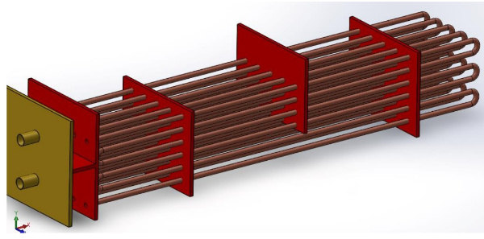
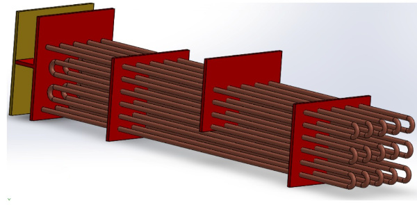
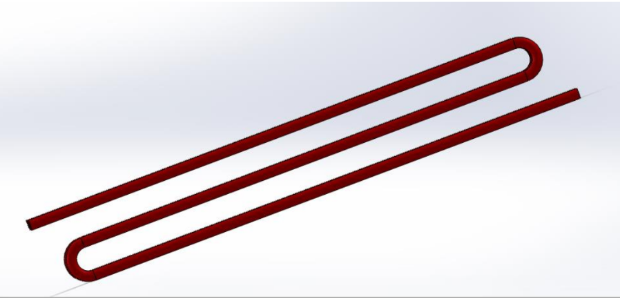
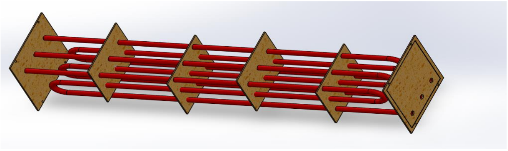
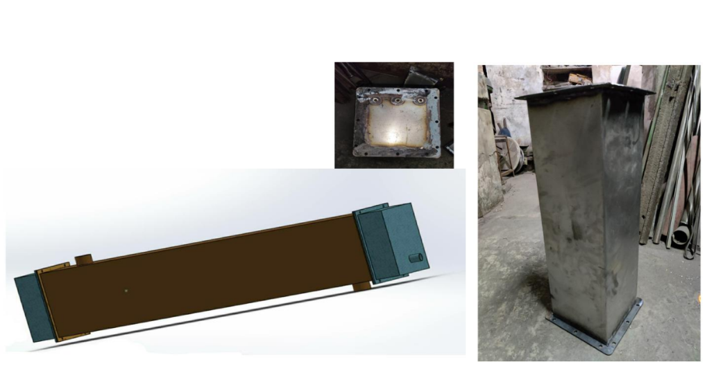
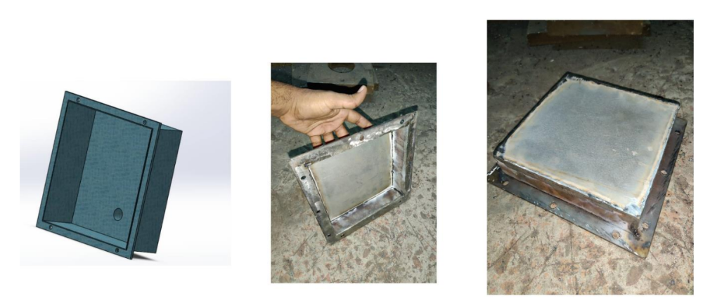
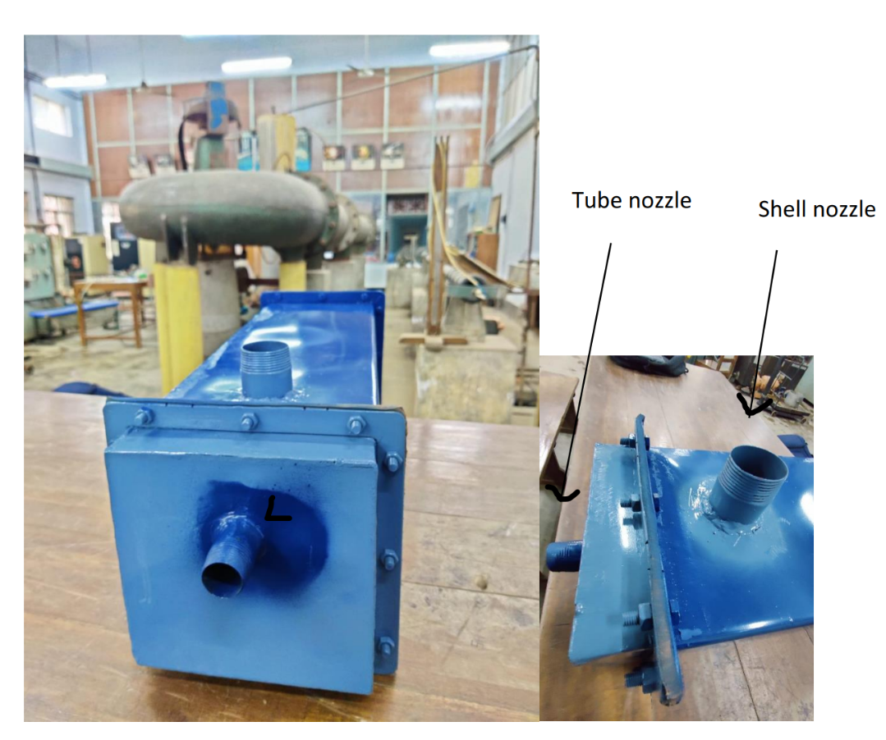
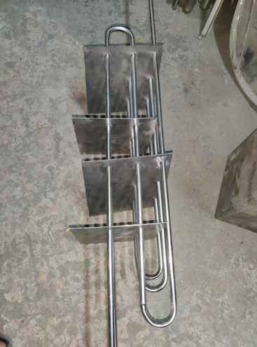
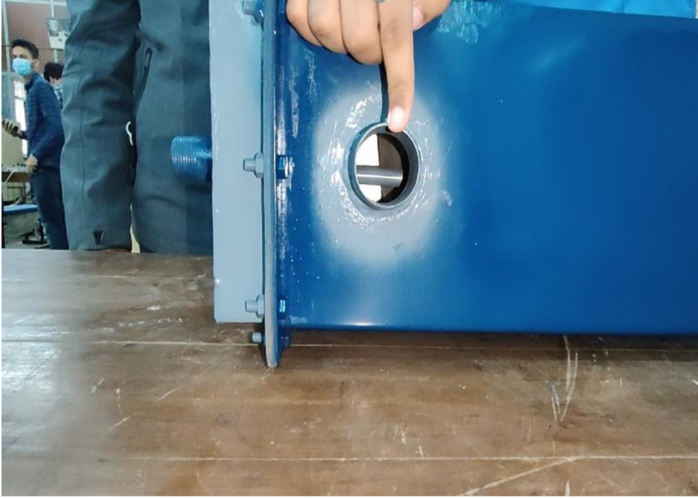
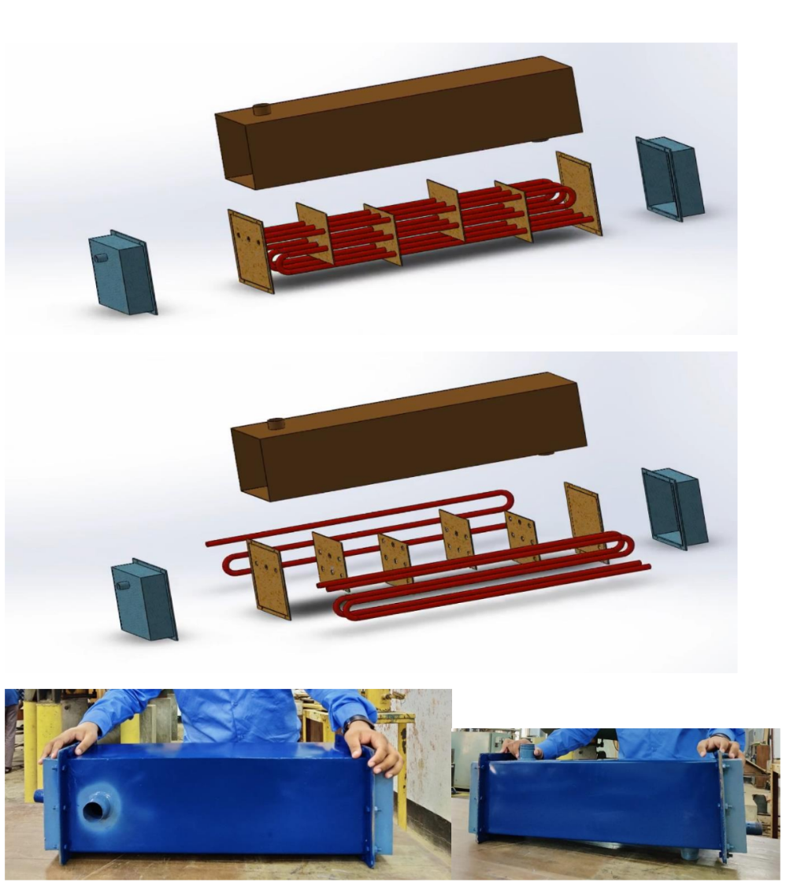

# Shell-and-Tube-Heat-Exchanger
Heat exchangers are devices used to transfer heat between two or more fluids (liquids or gases) that are at different temperatures. The primary purpose of a heat exchanger is to efficiently transfer thermal energy from one fluid to another, either for cooling or heating purposes.

Heat exchangers are widely used in various industries, including HVAC (heating, ventilation, and air conditioning), power generation, chemical processing, refrigeration, and automotive applications. They can be found in systems such as air conditioners, refrigerators, boilers, heat pumps, and oil coolers.

The basic principle of a heat exchanger involves bringing the hot and cold fluids into close contact with each other, while ensuring that they do not mix. This allows heat to transfer from the hotter fluid to the colder fluid without the two fluids directly coming into contact.

Heat exchangers can be classified into several types based on their designs and configurations. Some common types include:

   * Shell and tube heat exchangers: They consist of a series of tubes enclosed within a shell. One fluid flows through the tubes, while the other flows around the tubes in the shell. This design provides a large surface area for heat transfer.

   * Plate heat exchangers: These consist of a series of thin plates with corrugated surfaces. The hot and cold fluids flow in alternate channels created between the plates, allowing efficient heat transfer.

   * Finned heat exchangers: They have extended surfaces, called fins, attached to the heat transfer surfaces. Fins increase the heat transfer area, enhancing the efficiency of heat exchange.

   * Air-cooled heat exchangers: These are used when there is no availability of cooling water. They employ a combination of fins and fans to transfer heat from the process fluid to the ambient air.

These are just a few examples, and there are various other types of heat exchangers with different designs suited for specific applications. The selection of a heat exchanger depends on factors such as the fluids involved, desired heat transfer rate, space constraints, operating conditions, and cost considerations.

<b><b><b>Our Heat Exchanger</b></b></b>
Based on the design optimization using HTRI software, we initially made a shell and heat exchanger design. 

Accoriding to the software report, we had gotten,

* Shell diameter: 180 mm

* Tube Diameter: 12.7 mm

* Tube Length (for one pass): 1 m 

* Nozzle diameter for pipe: 26.65 mm (both inlet and outlet)

* Nozzle diameter for Shell: 26.65 mm (both inlet and outlet)

* Pressure drop in tube: 40.61 kPa (allowable = 50 kPa)
 
* Number of shell: 0.013 kPa (allowable = 75 kPa)

* Number of pass: 6

The shell and tube heat exchanger is shown below: 

Figure: Shell and tubes of heat exchanger with baffles

Figure: Different view of shell and tubes of heat exchanger

Initially, this shell and tube heat exchanger was going to be made. This project was being done in late 2021. That was the time of uncertainty for physical classes and gathering because of coronavirus pandemic. Our professors and lecturers were not sure whether or not there would be actual project display and whether we would have to actually physically build the heat exchanger.Our instructur advised us to make a scaled down prototype. The scaled down prototype had 3 tube 3 passes. The shell of the heat exchanger is square shaped. We used equivalent edge for the square edge from for the calculated shell diameter. The edge is 152 mm and we used low grade steel as a shell material. The material we used is stainless steel for the pipe also.Initially we wanted to use copper. But our instructor advised us to not use copper as copper is very expensive. We were opted to use stainless steel because the workshop worker told us he would be unable to make carbon steel tube with so many passes. Stainles steels have very poor thermal conductivity. The performance of this heat exchanger would be poor. For the pipes we did square shape pitch layout. The tube length is 0.6 meter with 3 turns.The diameter of the pipes are about 10 mm. We used 4 baffles to support the tubes as well as direct the shell flow. We did 20% cut to the baffles. The baffle spacing is 130 mm. Pipe nozzles diameter are 15mm and shell nozzles are 30 mm diameter.

Figure: Tubes of scaled down heat exchanger

Figure: 3 tubes undergoing 3 passes

Figure: Shell of scaled down heat exchanger

Figure: Shell cap of heat exchanger

Figure: Nozzle of heat exchanger

Figure: Tubes and baffles of heat exchanger

Figure: Tube inside heat exchanger

Figure: The complete heat exchanger

The heat exchanger needed poweful pump for testing. We were instructed by our instructor from BUET to not buy pumps and told to test in fluid mechanics lab if possible. Unfortunately, fluid lab could not provide us with the necessities. The heat exchanger performance was not tested. It should be noted that as the tubes were stainless steel, the perfomance would be very poor compared to a typical shell and tube heat exchanger. The link for the demonstration video which was taken in fluid mechanics lab : https://www.youtube.com/watch?v=aGyvpVADVLw

This project was done by S.M. Saleheen Osman Yeead,Md. Isharul Haque Nuhas and Md. Obaidur Rahman.
